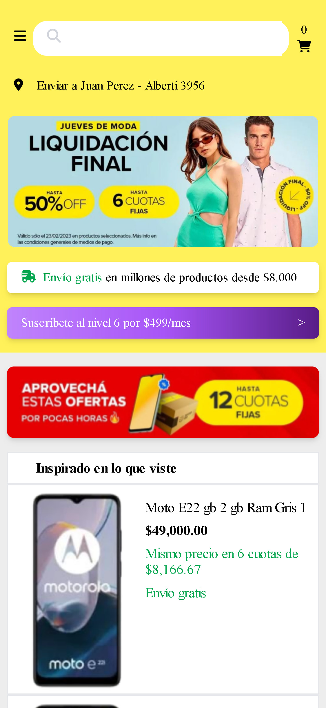

# s10-01-n-java-angular-mercadolibre
Clon de Mercadolibre
  

## Descripcion del proyecto  

El proyecto es un clon de Mercado Libre con funciones básicas y esenciales, construido en Java y Angular con vista desde la versión para móviles. El plan gral. del proyecto prevé la experiencia de la cadena de compra, desde la visión del usuario.  

## Tecnologias  

#Frontend  

    Angular,
    Typescript,
    SCSS,
    Tailwind,
    Angular CDK,
    Firebase  

#Backend  

    Java,
    SpringBoot,
    Apache,
    Railway

## Equipo

Frontend - Elcira Ibarra  

Frontend - Alejandro Falkenhagen  

Backend - Wilder Ruiz  

Backend - Oscar Jurado  

Backend - Stephany Castro Salas  

Backend - Mauro Spinello Alemani  

UXUI - Julian Tami  

Tester QA -  Maximiliano Barbosa  

Team Leader - Viarleth Aurora  

## Deploy

Firebase[link](https://meliclon.web.app/)  

Railway[link](https://backend-meli.up.railway.app/)  

## Documentacion  

Figma[link](https://www.figma.com/file/VMH9CkxzSoYqmsYZCPsJ6x/Clon-Meli?type=design&node-id=1-2&mode=design&t=MzT3rkzu34iN68fI-0)  

Notion[link](https://maxi-barbosa-proyects.notion.site/maxi-barbosa-proyects/Clon-Mercado-Libre-8807b6a24f7c4959936a3e448356716b)  

Trello[link](https://trello.com/b/L6vQPYeR/clonmercadolibre)  
