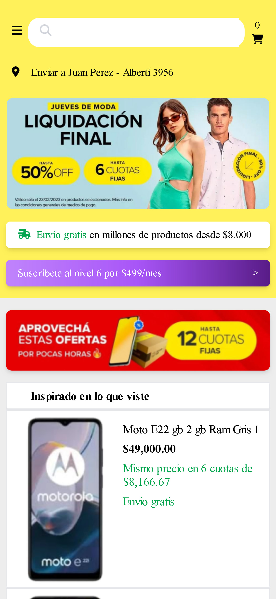
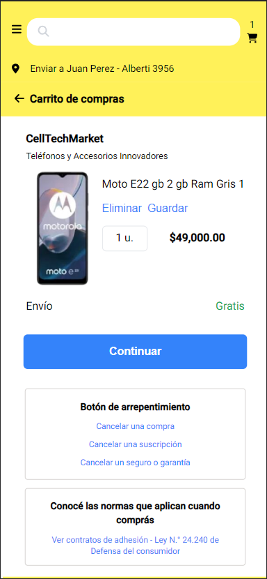

## s10-01-n-java-angular-mercadolibre

<p align="center"><a href="https://www.youtube.com/watch?v=EK6UVl2-PGQ"></a> <a href="https://www.youtube.com/watch?v=EK6UVl2-PGQ"></a></p> 

## *Proyecto*

Meli Clon es una Webapp móvil desarrollada para brindar a los usuarios una opción de compra sin tener que instalar ninguna app, en esta versión podrás buscar, comprar y enviar productos desde tu celular  con las funciones básicas y esenciales. Meli Clon es un proyecto que prevé la experiencia de la cadena de compra, desde la visión del usuario

## *Características*

```sh
 * Version mobile/responsive de la app mercado libre
 * Opcion de compra de productos
 * opcion de envio de productos
 * opcion de busqueda de productos
```

## *Tecnologias*

## *FrontEnd*:

    

## *BackEnd*:

   

## *Equipo*

### *Front*

- Elcira Ibarra <a href="https://www.linkedin.com/in/elcicode/" target="blank"></a> <a href = 'https://github.com/elcicode'> </a>
- Alejandro Falkenhagen <a href="https://www.linkedin.com/in/ajfalkenhagen/" target="blank"></a> <a href = 'https://github.com/Afalkenhagen'> </a>

### *Back*

- Wilder Ruiz <a href="https://www.linkedin.com/in/wilderruiz/" target="blank"></a> <a href = 'https://github.com/WilderVlz'> </a>
- Oscar Jurado <a href="" target="blank"></a> <a href = 'https://github.com/osdan97'> </a>
- Stephany Castro Salas <a href="https://www.linkedin.com/in/stephany-castro-salas/" target="blank"></a> <a href = 'https://github.com/StephanyCS1'> </a>

### *UX/UI*

- Julian Tami <a href="" target="blank"></a> <a href = 'https://github.com/Julitami'> </a>

### *Tester QA*

- Maximiliano Barbosa <a href="https://www.linkedin.com/in/maxi-barbosa/" target="blank"> </a> <a href = 'https://github.com/MaxiBarbo'> </a>

### *Team Leader*

- Viarleth Aurora

## *Deploy*

Firebase  [link](https://meliclon.web.app/)

Railway  [link](https://backend-meli.up.railway.app/)

## *Documentacion*

Diseño del proyecto en Figma  [link](https://www.figma.com/file/VMH9CkxzSoYqmsYZCPsJ6x/Clon-Meli?type=design&node-id=1-2&mode=design&t=MzT3rkzu34iN68fI-0)

Testing del proyecto en Notion  [link](https://maxi-barbosa-proyects.notion.site/maxi-barbosa-proyects/Clon-Mercado-Libre-8807b6a24f7c4959936a3e448356716b)

Organizacion del proyecto en Trello  [link](https://trello.com/b/L6vQPYeR/clonmercadolibre)

<hr/>

### 🔗 User History

### 🔗 [Documentacion Backend](Documentation.md)
